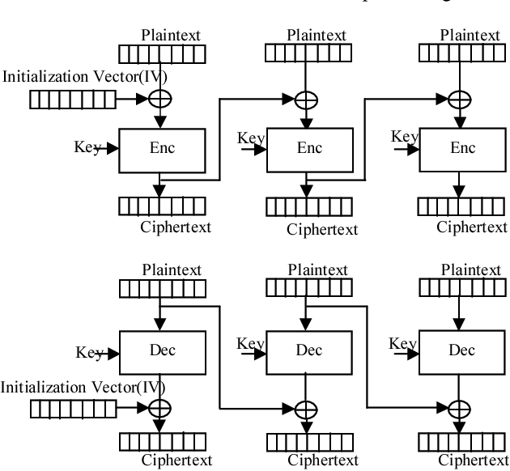

# File Encryption/Decryption with AES in Python

## What is AES?
AES or Advance encryption standard, is most secure and fastest public encryption.
AES is use to encrypt any file and messages. 
This encryption algorithm almost will not change the content size.

## How AES works?
AES get our key (password) and convert it to r keys.
Then each round starts with there own sub-keys.
Each round create addRoundKey that will use in next round. After that SubByte, ShiftRows, 
MixColumns and creating   AddRoundKey will execute.


The bellow figure is showing the functions of each round.


## What is mode?
Data convert to 128 bit. The encryption algorithms, will swap bits. The algorithm of swapping bits 
called mode. For example one of the secure modes is CBC.




### How CBC works?
In the first round we need initial Vector (IV). IV is a string that will XOR with 128 bit of our content.
The result will use to XOR with the next block. So each block of 128 bit will XOR by the previous Ciphertext.

## Usage
Use `f` flag to set e or d for Encryption or Decryption. 

Use `p` flag for setting file path you want to encrypt/decrypt.

NOTICE: This Code will NOT override any file while encrypting or decrypting.
```
usage: main.py [-h] -f FUNCTION -p PATH
main.py: error: the following arguments are required: -f/--function, -p/--path
```

## Example 
```
main -f e -p main.py # encryption 
main -f d -p main.encrypted # decryption 
```

## Licence
This code is other MIT licence. for more [licence](read). 